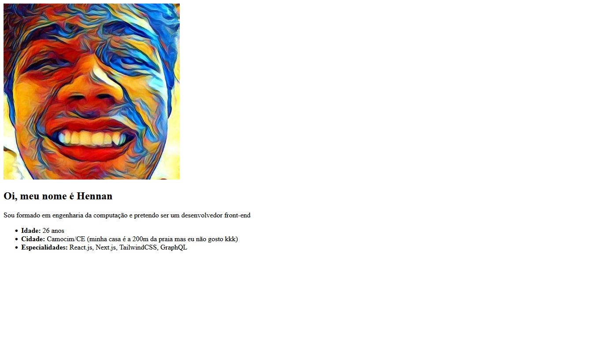
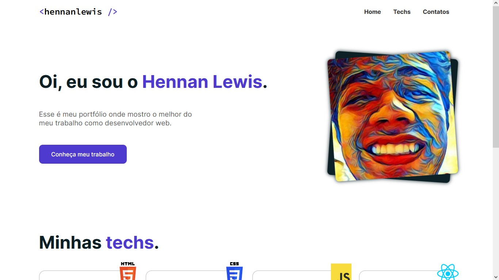
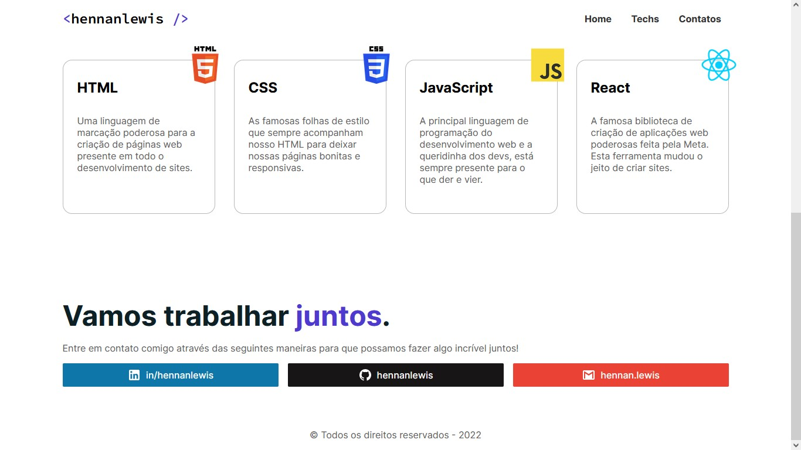
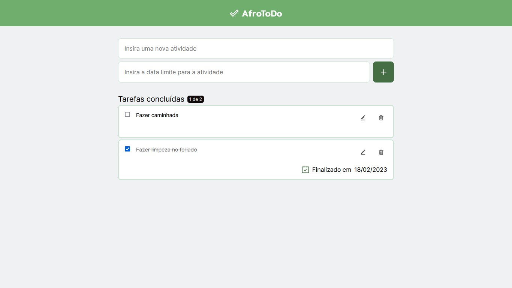

# Afro Academy

Repositório destinado aos projetos do treinamento da Afro Academy.

Todos os projetos são hospedados no Github Pages, então para acessá-los, clique no projeto correspondente abaixo:

## [Projeto 1](https://hennanlewis.github.io/afro-academy/projeto1)
Apresentação em html simples

## [Projeto 2](https://hennanlewis.github.io/afro-academy/projeto2)
Página de portfólio

## [Desafio 3 - AfroToDo](https://hennanlewis.github.io/afro-academy/desafio3)

O projeto inicial é uma ToDo List simples que apenas insere, exclui e salva no localStorage. Funções de adicionais do desafio: 
- adição de data limite
- adição de data de conclusão
- adição de função de edição

